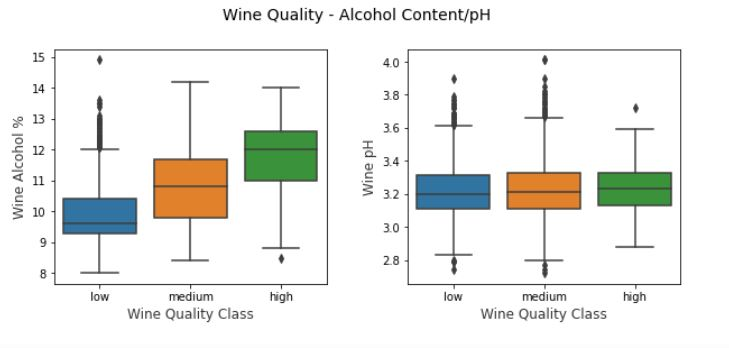

## Data Exploration

The **wines data frame** can be used for most of the further analysis moving forward. However, it is a good idea to keep the **red_wine** and **white_wine** data frames as well to do basic exploratory analysis and visualizations.

- [Check how](https://pandas.pydata.org/pandas-docs/stable/reference/api/pandas.DataFrame.head.html) you can print first, last 10 records.

- Check [wines.info()](https://pandas.pydata.org/pandas-docs/stable/reference/api/pandas.DataFrame.info.html), [wines.shape](https://pandas.pydata.org/pandas-docs/stable/reference/api/pandas.DataFrame.shape.html)

- Observe if there is missing values. [More details](https://pandas.pydata.org/pandas-docs/stable/user_guide/missing_data.html)

- Can you create a table like below to compare the **Descriptive Statistics** between Red wine and White wine. 

As always, you can try to be more innovative using some other way of representations.

(Hint : Revisit [concat function](https://pandas.pydata.org/pandas-docs/stable/reference/api/pandas.concat.html))  

One can observe that the mean value of sulfates and volatile acidity seem to be higher in red wine as compared to white wine.  
**Can you come up with few more observations. Write these down as comment or notes on Google Colab / Jupyter notebook**

- Come up with few visualizations which compare **low, medium and high quality** wine.

For example,

Can you think of other charts which explain this kind of analysis ? 
Try to explore different kinds of charts and choose the appropriate ones.

**Come up with at least 5 more charts with explanations.**

## Resources

- [Beginner's guide for Matplotlib](https://www.analyticsvidhya.com/blog/2020/02/beginner-guide-matplotlib-data-visualization-exploration-python/)

- [Matplotlib documentation](https://matplotlib.org/contents.html)
