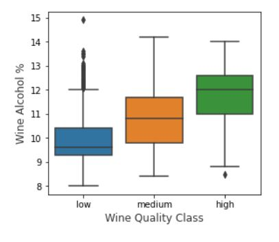
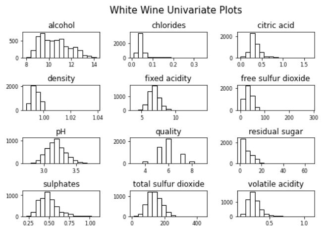
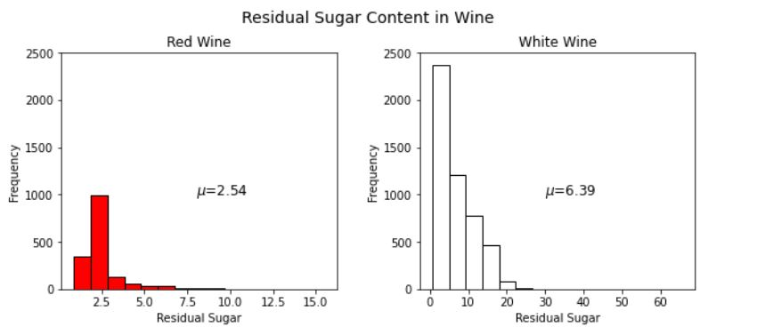

This is a branch of inferential statistics which basically draw inferences and propositions of a population using a data sample.
The idea is to use statistical methods and models to draw statistical inferences from a given hypotheses. Each hypothesis consists of a null hypothesis and an alternative hypothesis.  

Before you move forward, it is a good idea to clear your concept.  
[More details](https://www.statisticshowto.com/probability-and-statistics/hypothesis-testing/#Hypothesis) are here.

Therefore, based on statistical test results, if the result is statistically significant based on pre-set significance levels (e.g., if obtained p-value is less than 5% significance level), one can reject the null hypothesis in favor of the alternative hypothesis.

Otherwise, if the results is not statistically significant, one can  conclude that the null hypothesis was correct.  

### Can you think of applying this to prove if Mean 'Alcohol levels' vary significantly among the low quality, medium quality and high quality wines?

A great statistical model to prove or disprove the difference in mean among subsets of data is to use the one-way ANOVA test.

ANOVA stands for “analysis of variance,” which is a nifty statistical model and can be used to analyze statistically significant differences among means or averages of various groups. This is basically achieved using a statistical test that helps one determine whether or not the means of several groups are equal.

Here is a good [Introduction to Anova](https://www.statisticshowto.com/probability-and-statistics/hypothesis-testing/anova/)

[](https://www.youtube.com/watch?v=-yQb_ZJnFXw)


Once the concepts are clear, let's get back to the original question:

'Check if **mean** **alcohol levels** vary **significantly** among the low quality, medium quality and high quality wines.'

The below line of code implements that for Alcohol level.

[SciPy](https://docs.scipy.org/doc/scipy/reference/stats.html) is the most widely used Python library for Statistical analysis.

```
from scipy import stats

F, p = stats.f_oneway(wines[wines['quality_label'] == 'low']['alcohol'],
wines[wines['quality_label'] == 'medium']['alcohol'],
wines[wines['quality_label'] == 'high']['alcohol'])
print('ANOVA test for mean alcohol levels across wine samples with different quality
ratings')
print('F Statistic:', F, '\tp-value:', p)

```

The output looks like that:

```
ANOVA test for mean alcohol levels across wine samples with different quality
F Statistic: 673.0745347231032 	p-value: 2.2715337450621843e-266s
```

You can clearly see that we have a p-value much less than 0.05 in the first test  This tells us that there is a statistically significant difference in alcohol level means for at least two groups out of the three (hence, **rejecting the null hypothesis** in favor of the alternative).

As you probably remember from previous days, the box plot for Alcohol levels show significant difference:



Can you find Statistical Significance between other features.\
Try to explore few more features and put your findings with exaplnations on learning report.
(hint: *pH level*)

## Univariate Analysis

This is perhaps one of the easiest yet a core foundational step in exploratory data analysis. Univariate analysis involves analyzing data such that at any instance of analysis you are only dealing with one variable or feature. No relationships or correlations are analyzed among multiple variables. The simplest way to easily visualize all the variables in your data is to build some histograms. 

The following snippet helps visualize distributions of data values for all features. While histogram may not be an appropriate visualization in many cases, it is a good one to start with for numeric data.

[Aa article Univariate Analysis with Panda](https://www.kaggle.com/residentmario/univariate-plotting-with-pandas)


```
red_wine.hist(bins=15, color='red', edgecolor='black', linewidth=1.0,
xlabelsize=8, ylabelsize=8, grid=False)

plt.tight_layout(rect=(0, 0, 1.2, 1.2))

rt = plt.suptitle('Red Wine Univariate Plots', x=0.65, y=1.25, fontsize=15)

```


Similar way, try to generate for White wine.



The power of packages like matplotlib and pandas enable you to easily plot variable distributions. Do you notice any interesting patterns across the two wine types?

You can choose single feature and analyse it.

For example, take the feature named **residual sugar** and plot the distributions across data pertaining to red and white wine samples.



The code which generates the above plot is here (You can notice, the plot is using *Matplotlib Object Oriented Interface*):

```
fig = plt.figure(figsize = (10,4))
title = fig.suptitle("Residual Sugar Content in Wine", fontsize=14)
fig.subplots_adjust(top=0.85, wspace=0.3)
ax1 = fig.add_subplot(1,2, 1)
ax1.set_title("Red Wine")
ax1.set_xlabel("Residual Sugar")
ax1.set_ylabel("Frequency")
ax1.set_ylim([0, 2500])
ax1.text(8, 1000, r'$\mu$='+str(round(red_wine['residual sugar'].mean(),2)),
fontsize=12)
r_freq, r_bins, r_patches = ax1.hist(red_wine['residual sugar'], color='red', bins=15,
edgecolor='black', linewidth=1)
ax2 = fig.add_subplot(1,2, 2)
ax2.set_title("White Wine")
ax2.set_xlabel("Residual Sugar")
ax2.set_ylabel("Frequency")
ax2.set_ylim([0, 2500])
ax2.text(30, 1000, r'$\mu$='+str(round(white_wine['residual sugar'].mean(),2)),
fontsize=12)
w_freq, w_bins, w_patches = ax2.hist(white_wine['residual sugar'], color='white', bins=15,
edgecolor='black', linewidth=1)

```

***Your task is to analyse the features and make some interesting observations.***
