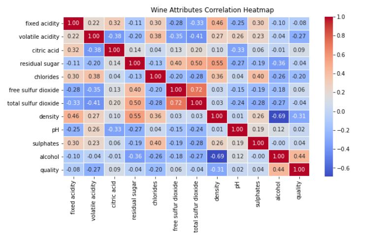
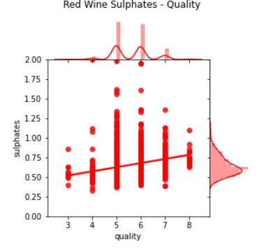
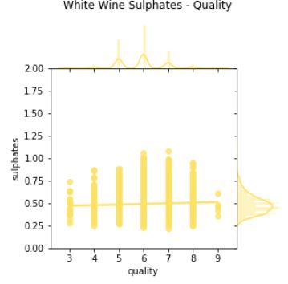
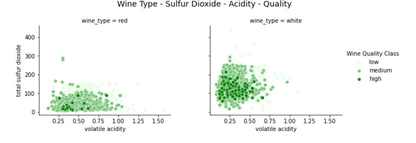
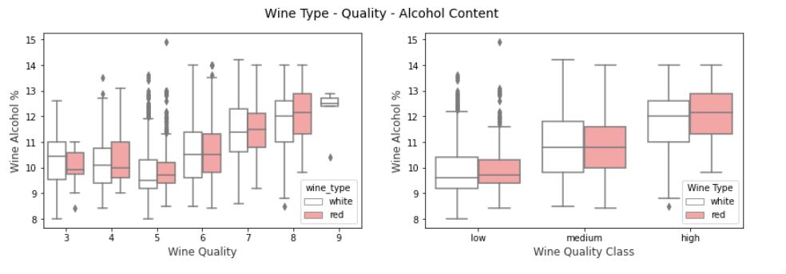

Analyzing multiple feature variables and their relationships is what multivariate analysis is all about. Check if there are any interesting patterns and relationships among the physicochemical attributes of our wine samples, which might be helpful in your modeling process in the future.

One of the best ways to analyze features is to build a pairwise correlation plot depicting the correlation coefficient between each pair of features in the dataset. The following snippet helps you build a correlation matrix and plot the same in the form of an easy-to-interpret heatmap.

[What is Correlation Matrix ?](https://likegeeks.com/python-correlation-matrix/)

You can now try to generate correlation matrix :



You can use similar plots on other variables and features to discover more patterns and relationships. To observe relationships among features with a more microscopic view, joint plots are excellent visualization tools specifically for multivariate visualizations. The following snippet depicts the relationship between wine types, sulphates, and quality ratings.



```
rj = sns.jointplot(x='quality', y='sulphates', data=red_wine,
kind='reg', ylim=(0, 2),
color='red', space=0, size=4.5, ratio=4)
rj.ax_joint.set_xticks(list(range(3,9)))
fig = rj.fig
fig.subplots_adjust(top=0.9)
t = fig.suptitle('Red Wine Sulphates - Quality', fontsize=12);
```



Did you notice there seems to be some pattern depicting lower sulphate levels for higher quality rated wine samples, the correlation is quite weak. However, you can see clearly that sulphate levels
for red wine are much higher as compared to the ones in white wine. In this scenario, you have shown three features (type, quality, and sulphates) with the help of two plots.  

*What if you would have wanted to visualize a higher number of features and determine patterns from them?*

The **seaborn framework** provides facet grids that help you visualize higher number of variables in 2-D plots.

You can try to visualize relationships between wine type, quality ratings, volatile acidity, and alcohol volume levels.


The below code use ***FacetGrid*** function from seaborn and generate the above plot.

```
g = sns.FacetGrid(wines, col="wine_type", hue='quality_label',
col_order=['red', 'white'], hue_order=['low', 'medium', 'high'],
aspect=1.2, size=3.5, palette=sns.light_palette('navy', 3))
g.map(plt.scatter, "volatile acidity", "alcohol", alpha=0.9,
edgecolor='white', linewidth=0.5)
fig = g.fig
fig.subplots_adjust(top=0.8, wspace=0.3)
fig.suptitle('Wine Type - Alcohol - Quality - Acidity', fontsize=14)
l = g.add_legend(title='Wine Quality Class')
```

***Your task would be to try to use the Seaborn library and create some interesting plots.***

For example,





## Resources

- [Understanding box plots](https://towardsdatascience.com/understanding-boxplots-5e2df7bcbd51#:~:text=A%20boxplot%20is%20a%20graph,the%20data%20are%20spread%20out.&text=Boxplots%20are%20a%20standardized%20way,%2C%20and%20%E2%80%9Cmaximum%E2%80%9D)

- [Seaborn: what it can do for you](https://github.com/pb111/Data-Visualization-with-Seaborn)
