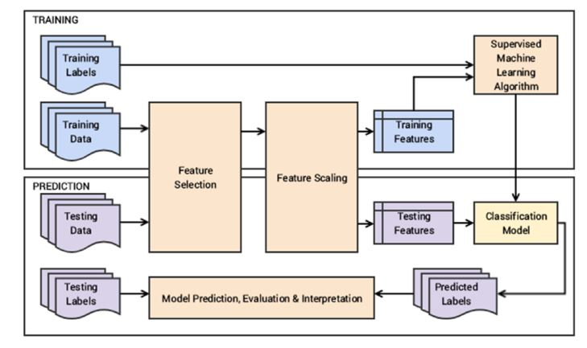

After you have analyzed and explored the data, you have quite a good overview of the data. That is super crucial before you deep dive into the Machine Learning / Predictive Modelling.

Let's have a look at what you have done so far in the project:

#### Data Acquisition

- You have gathered / acquired the data (in CSV format)

#### Data Exploration

- Then, you checked datatypes and missing values (if any).  

- Descriptive statistics and Hypothesis testing.

- Data exploration by help of data visualisation.

## **What is Next ?**

Before we move to Predictive modelling, we need to clarify the basics:
[Machine Learning basics](https://github.com/CodeAcademyBerlin/Data-Science/blob/master/Module%201/Week%204/Machine%20Learning%20basics.md).

## Predictive Modelling

- Predict Wine Types ( ***Red*** / ***White*** wine)

- Predict Wine Quality ( ***Low*** / ***Medium*** / ***High***).  
You can also have your defined number of lables instead of just these 3.

For the part ***Predictive Modelling***, you would need to get introduced to ***scikit-learn***, a widely used machine learning library in Python.

Before starting the analysis, you can have a basic understanding of  scikit-learn by following below guide:

[An introduction to machine learning with scikit-learn](https://scikit-learn.org/stable/tutorial/basic/tutorial.html#learning-and-predicting)

Please take a note of the methods & functions being used.  

#### First step would be to load the libraries required

Identify the libraries which have been loaded from Scikit-Learn and if you don't know them, please have a look at official doc.

```
import pandas as pd
import numpy as np
import matplotlib.pyplot as plt
import model_evaluation_utils as meu
from sklearn.model_selection import train_test_split
from collections import Counter
from sklearn.preprocessing import StandardScaler
from sklearn.preprocessing import LabelEncoder

```

Let’s briefly look at the workflow you will be following for your predictive systems. You will focus on two major phases— ***model training*** and ***model predictions & evaluation.***



You can see that training data and testing data refer to the wine quality dataset features.  
You already have the necessary wine features. Sometime you need to create features out of existing ones and this is called Feature Engineering.  

***Prediction Labels*** can be either wine types or quality based on the classification system. In the training phase, feature selection will mostly involve selecting all the necessary wine physicochemical attributes and then after necessary scalingyou have to train your predictive models for prediction and evaluation in the prediction phase.

### Predicting Wine Types

In the wine quality dataset, you have two variants or types of wine : red and white wine. The main task of this classification system in this section is to predict the wine type based on other features.

To start with, you will first select the necessary features in train set and separate out the prediction class in test set. 

You do not need to follow the codes. It is just a guideline so that you do not feel lost.

**wtp** = **wine type prediction**

```
wtp_features = wines.iloc[:,:-3]
wtp_feature_names = wtp_features.columns
wtp_class_labels = np.array(wines['wine_type'])

wtp_train_X, wtp_test_X, wtp_train_y, wtp_test_y = train_test_split(wtp_features,
wtp_class_labels, test_size=0.3, random_state=42)

print(Counter(wtp_train_y), Counter(wtp_test_y))
print('Features:', list(wtp_feature_names))

```

***Check what is Counter and random_state***

The numbers above shows you the wine samples for each class and you can also see the feature names which will be used in your feature set.

#### Preprocessing

According to the wikipedia, ***Data preprocessing*** is an important step in the data mining process. The phrase "garbage in, garbage out" is particularly applicable to data mining and machine learning projects.

One of the way to preprocess is to apply ***scaling the features***. You can use a standard scaler in this scenario. You are encouraged to go through [this tutorial](https://scikit-learn.org/stable/modules/preprocessing.html) which explains **Presprocessing with sklearn**.

```
 # Define the scaler
wtp_ss = StandardScaler().fit(wtp_train_X)
# Scale the train set
wtp_train_SX = wtp_ss.transform(wtp_train_X)
# Scale the test set
wtp_test_SX = wtp_ss.transform(wtp_test_X)
```

You can explore more on this and do not forget to read some articles and take some keypoints to put on your learning report.

## Interesting reads

[Article on preprocessing techniques](https://towardsdatascience.com/data-preprocessing-for-machine-learning-in-python-2d465f83f18c)

## Interesting Reads

[scikit-learn-hacks-tips-tricks](https://www.analyticsvidhya.com/blog/2020/05/7-scikit-learn-hacks-tips-tricks/)

## Resources

[official doc scikit-learn](https://scikit-learn.org/stable/)
