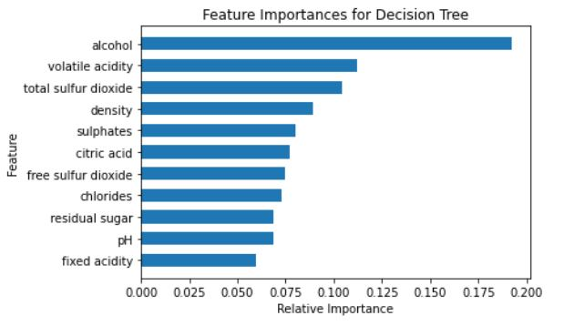
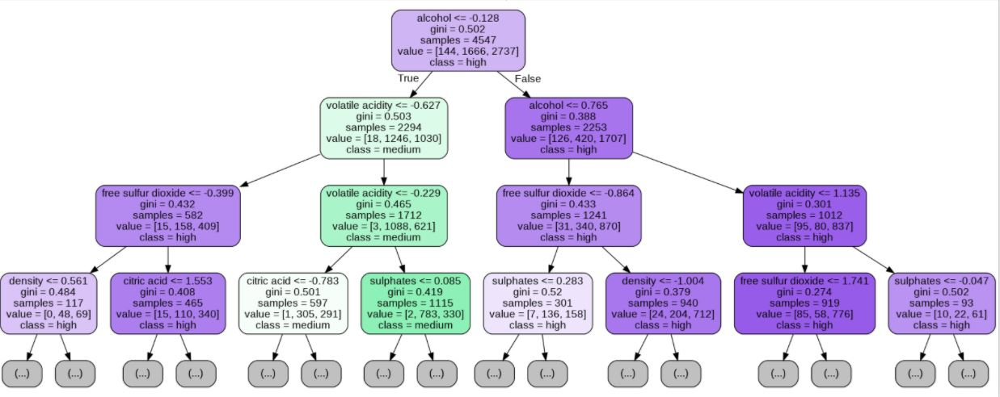

In the wine quality dataset, we have several quality rating classes ranging from 3 to 9. You can choose to narrow it down to 3 levels (e.g., high , medium and low ) or you keep the number of levels as it was.

The below approach focuses on the quality_label variable that classifies wine into low, medium, and high ratings.

You have to follow the same steps like before with the wine 'quality_label':

```
wqp_features = wines.iloc[:,:-3]
wqp_class_labels = np.array(wines['quality_label'])
wqp_label_names = ['low', 'medium', 'high']
wqp_feature_names = list(wqp_features.columns)
wqp_train_X, wqp_test_X, wqp_train_y, wqp_test_y = train_test_split(wqp_features,
wqp_class_labels, test_size=0.3, random_state=42)

print(Counter(wqp_train_y), Counter(wqp_test_y))
print('Features:', wqp_feature_names)
```

From the preceding output, it is quite evident you have very few wine samples of high class rating and a lot of medium quality wine samples. 

Time to move on to the next step of feature scaling.

```
# Define the scaler
wqp_ss = StandardScaler().fit(wqp_train_X)
# Scale the train set
wqp_train_SX = wqp_ss.transform(wqp_train_X)
# Scale the test set
wqp_test_SX = wqp_ss.transform(wqp_test_X)
```

The Decision Tree Classifier is a good example of a classic tree model. This is based on the concept of decision trees, which focus on using a tree-like graph or flowchart to model decisions and their possible outcomes. Each decision node in the tree represents a decision test on a specific data attribute. Edges or branches from each node represent possible outcomes of the decision test. Each leaf node represents a predicted class label. To get all the end-to-end classification rules, you need to consider the paths from the root node to the leaf nodes. 

Decision tree models in the context of Machine Learning are non-parametric supervised learning methods, which use these decision tree based structures for classification and regression tasks. The core objective is to build a model such that you can predict the value of a target response variable by leveraging decision tree based structures to learn decision rules from the input data features. 

The main advantage of decision tree based models is model interpretability, since it is quite easy to understand and interpret the decision rules which led to a specific model prediction. Besides this, other advantages include the model’s ability to handle both categorical and numeric data with ease as well as multi-class classification problems. 

Trees can be even visualized to understand and interpret decision rules better.

```
# train the model
from sklearn.tree import DecisionTreeClassifier
from sklearn.metrics import classification_report
wqp_dt = DecisionTreeClassifier()
wqp_dt.fit(wqp_train_SX, wqp_train_y)

# predict and evaluate performance
wqp_dt_predictions = wqp_dt.predict(wqp_test_SX)

print(classification_report(wqp_test_y,wqp_dt_predictions, target_names=wqp_label_names))
```


```

              precision    recall  f1-score   support

         low       0.25      0.30      0.27        54
      medium       0.69      0.68      0.69       718
        high       0.78      0.78      0.78      1178

    accuracy                           0.73      1950
   macro avg       0.57      0.59      0.58      1950
weighted avg       0.73      0.73      0.73      1950

```
(Note : the above classification report looks a bit weird (check **support**, in case you do not get it, please discuss with your mentor).)


Looking at the class based statistics; we can see the recall for the high quality wine samples is pretty bad since a lot of them have been misclassified into medium and low quality ratings.

This is kind of expected since we do not have a lot of training samples for high quality wine if you remember the training sample sizes from earlier.  

Considering low and high quality rated wine samples, you should at
least try to see if you can prevent the model from predicting a low quality wine as high and similarly prevent predicting a high quality wine as low. Interpreting this model, you can use the following code to look at the feature importance scores based on the patterns learned by the model.

```
wqp_dt_feature_importances = wqp_dt.feature_importances_
wqp_dt_feature_names, wqp_dt_feature_scores = zip(*sorted(zip(wqp_feature_names,
wqp_dt_feature_importances), key=lambda x: x[1]))
y_position = list(range(len(wqp_dt_feature_names)))
plt.barh(y_position, wqp_dt_feature_scores, height=0.6, align='center')
plt.yticks(y_position , wqp_dt_feature_names)
plt.xlabel('Relative Importance')
plt.ylabel('Feature')
t = plt.title('Feature Importances for Decision Tree')

```



You can clearly observe that the most important features are Alcohol and volatile acidity.

In the Decision tree session earlier, you saw that one can also easily visualize the decision tree structure from decision tree models and check out the decision rules that it learned from the underlying
features used in prediction for new data samples. The following code helps us visualize decision trees:

```
from graphviz import Source
from sklearn import tree
from IPython.display import Image

graph = Source(tree.export_graphviz(wqp_dt, out_file=None, class_names=wqp_label_names,filled=True, rounded=True, special_characters=False,feature_names=wqp_feature_names, max_depth=3))

Image(png_data)
```



Decision tree model has a huge number of nodes and branches hence you visualized the tree for a ***max depth of three*** based on the preceding snippet.

You can start observing the decision rules from the tree
where the starting split is determined by the rule of alcohol <= -0.128 and with each **yes/no** decision branch split, there are further decision nodes as you descend into the tree at each depth level.

The class variable is what you are trying to predict, i.e. wine quality being low, medium, or high and value determines the total number of samples at each class present in the current decision node at each instance.
The gini parameter is basically the criterion which is used to determine and measure the quality of the split at each decision node. Best splits can be determined by metrics like **gini impurity/gini index or information gain**.

To refresh, you can have a look at this example [Gini Index -CART Decision Algorithm in Machine Learning](https://medium.com/@riyapatadiya/gini-index-cart-decision-algorithm-in-machine-learning-1a4ed5d6140d)

***Your task is to explore more on decision tree and try to check parameters***

[decision tree classifier ](https://scikit-learn.org/stable/modules/generated/sklearn.tree.DecisionTreeClassifier.html)
